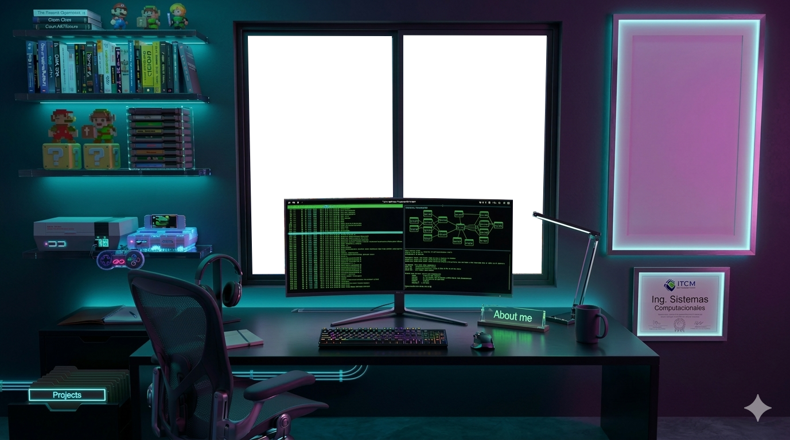

Estuve mirando la estructura de tu repo y lo que está pasando es algo muy común cuando un proyecto empieza a ponerse divertido: **los efectos crecen más rápido que la arquitectura**. No es un error, es señal de exploración creativa. Ahora toca hacer lo que hacen los motores de videojuegos después de un prototipo: **organizar el sistema sin perder magia**.

La idea clave es esta: tu portafolio no es una página… **es una escena interactiva**. Si pensamos así, la arquitectura se vuelve obvia.

Hay cuatro sistemas reales en tu proyecto:

– escena (cuarto, fondo, video)
– tema (light/dark)
– iluminación del mouse
– VSCode / UI interactiva

Si separas eso, el código deja de sentirse caótico.

Voy a proponerte una arquitectura **minimalista pero profesional**.

---

# 1. Estructura de carpetas limpia

Tu repo puede quedar así:

```
portfolio-room
│
├── index.html
│
├── assets
│   ├── images
│   │   room-dark.png
│   │   room-light.png
│   │
│   └── video
│       bg-dark.mp4
│       bg-light.mp4
│
├── css
│   base.css
│   layout.css
│   effects.css
│   themes.css
│
└── js
    main.js
    theme.js
    mouseLight.js
    scene.js
```

Esto tiene una lógica clara:

```
base.css → reset y fuentes
layout.css → estructura del sitio
effects.css → animaciones y overlays
themes.css → dark/light
```

y en JS:

```
main.js → punto de entrada
theme.js → cambio de tema
mouseLight.js → iluminación
scene.js → fondo + video + cuarto
```

Nada más.

---

# 2. index.html limpio

El HTML debe ser casi **estático y simple**.

```html
<body data-theme="dark">
  <video id="bgVideo" autoplay muted loop playsinline></video>

  <div class="mouse-light"></div>

  <main class="scene">
    
  </main>

  <button id="themeToggle">toggle</button>

  <script type="module" src="js/main.js"></script>
</body>
```

Observa algo importante:
el HTML **no tiene lógica**.

Solo tiene **elementos de la escena**.

---

# 3. main.js (el orquestador)

Este archivo solo inicia sistemas.

```javascript
import { initTheme } from "./theme.js";
import { initMouseLight } from "./mouseLight.js";
import { initScene } from "./scene.js";

initScene();
initTheme();
initMouseLight();
```

Eso es todo.

El archivo principal queda ridículamente simple.

---

# 4. scene.js (maneja habitación + video)

```javascript
const room = document.getElementById("roomImage");
const video = document.getElementById("bgVideo");

const themes = {
  dark: {
    room: "assets/images/room-dark.png",
    video: "assets/video/bg-dark.mp4",
  },

  light: {
    room: "assets/images/room-light.png",
    video: "assets/video/bg-light.mp4",
  },
};

export function setScene(theme) {
  room.src = themes[theme].room;

  video.pause();
  video.src = themes[theme].video;
  video.load();
  video.play();
}

export function initScene() {
  const theme = localStorage.getItem("theme") || "dark";

  setScene(theme);
}
```

Esto encapsula **toda la lógica visual del cuarto**.

---

# 5. theme.js (solo maneja el tema)

```javascript
import { setScene } from "./scene.js";

export function initTheme() {
  const btn = document.getElementById("themeToggle");

  let theme = localStorage.getItem("theme") || "dark";

  document.body.dataset.theme = theme;

  btn.addEventListener("click", () => {
    theme = theme === "dark" ? "light" : "dark";

    document.body.dataset.theme = theme;

    localStorage.setItem("theme", theme);

    setScene(theme);
  });
}
```

Aquí solo ocurre una cosa:

```
usuario cambia tema
↓
body cambia dataset
↓
scene actualiza habitación + video
```

Arquitectura limpia.

---

# 6. mouseLight.js

Este sistema queda aislado.

```javascript
export function initMouseLight() {
  const overlay = document.querySelector(".mouse-light");

  if (!overlay) return;

  let x = window.innerWidth / 2;
  let y = window.innerHeight / 2;

  update(x, y);

  window.addEventListener("mousemove", (e) => {
    x = e.clientX;
    y = e.clientY;

    update(x, y);
  });

  function update(x, y) {
    overlay.style.background = `radial-gradient(circle at ${x}px ${y}px,
rgba(255,255,255,0.15),
transparent 300px)`;
  }
}
```

Esto evita que tu script de iluminación **contamine todo el proyecto**.

---

# 7. CSS de efectos separado

En `effects.css`:

```css
.mouse-light {
  position: fixed;
  top: 0;
  left: 0;

  width: 100%;
  height: 100%;

  pointer-events: none;

  z-index: 2;
}
```

---

# 8. themes.css

```css
body[data-theme="dark"] {
  background: #0c0c0f;
  color: white;
}

body[data-theme="light"] {
  background: #f4f4f6;
  color: #111;
}
```

---

# 9. Resultado de esta arquitectura

Tu proyecto pasa de esto:

```
scripts mezclados
efectos dispersos
difícil de mantener
```

a esto:

```
scene system
theme system
lighting system
ui system
```

Cada uno independiente.

Eso es exactamente cómo organizan las **interfaces complejas o escenas web interactivas**.

---

# 10. Mejora que te recomendaría después

Tu portafolio ya tiene algo poderoso:

```
escena de cuarto
↓
explorar monitor
↓
descubrir contenido
```

Eso es **environment storytelling**, una técnica que usan videojuegos como
Half-Life 2 o The Last of Us donde el entorno cuenta la historia.

El siguiente salto natural sería hacer que **algunos objetos del cuarto sean interactivos**:

```
monitor → abre VSCode
libro → about me
pantalla → proyectos
poster → experiencia
```

Eso convertiría tu portafolio en algo que la gente **explora**, no solo lee.

Y ese tipo de portafolios son los que los recruiters recuerdan.
